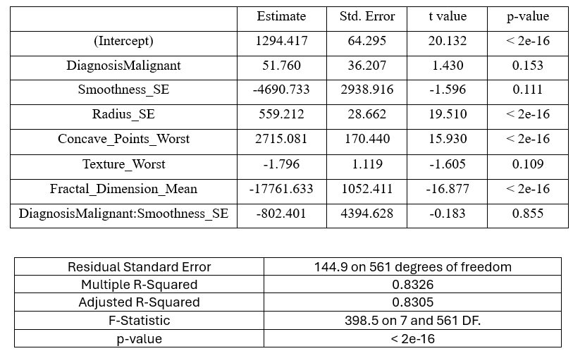
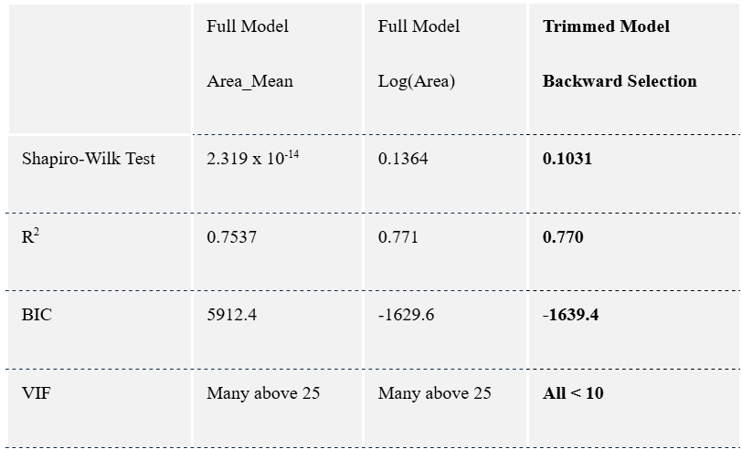
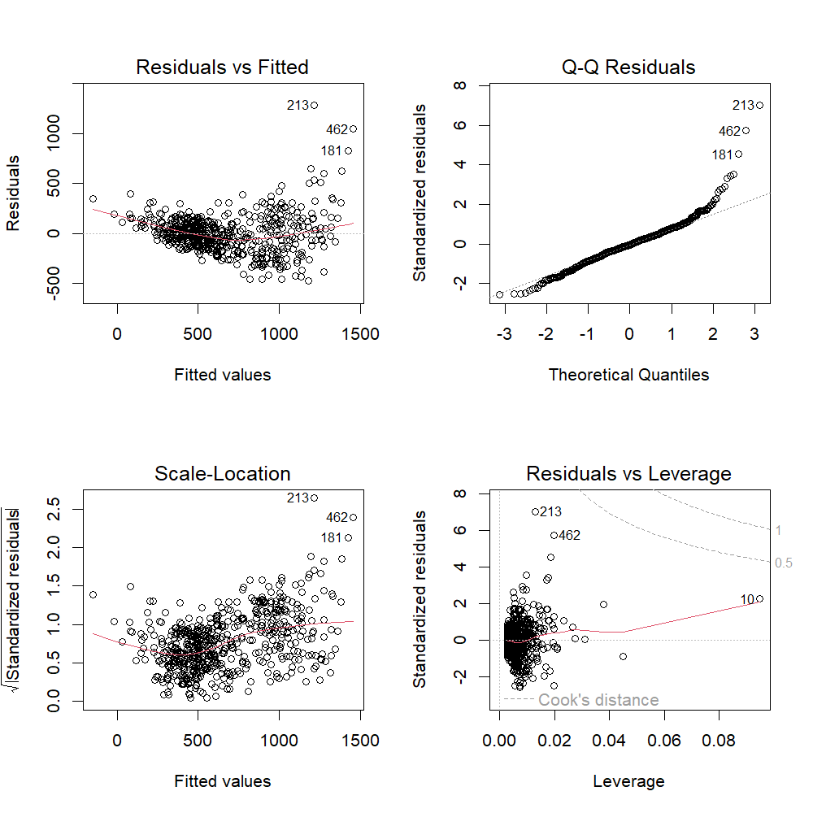
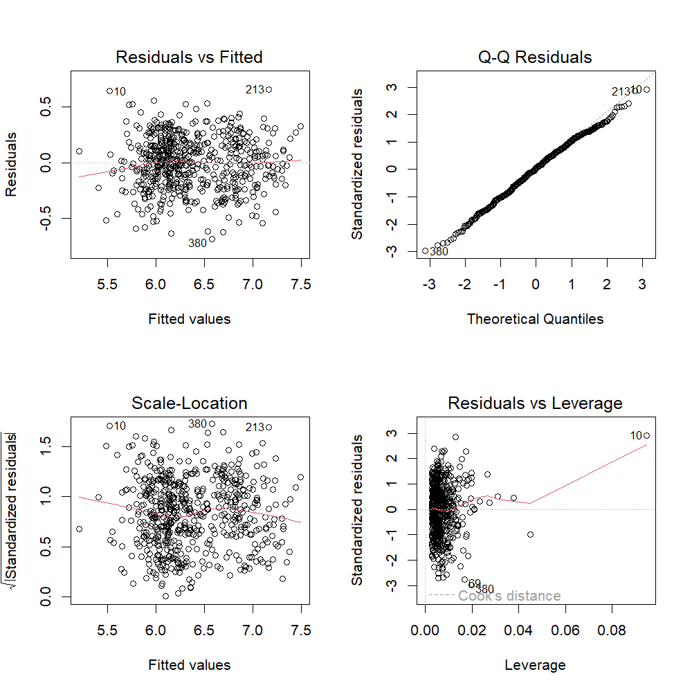
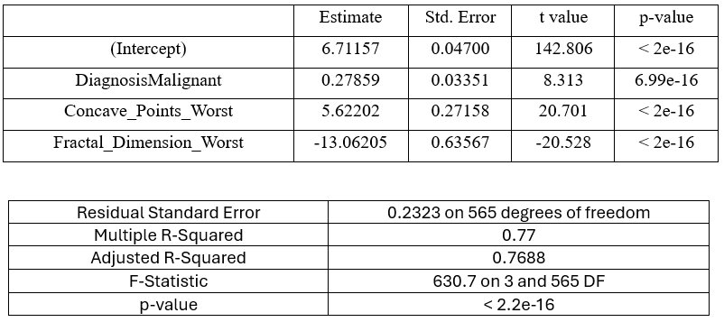

```{r setup, include=FALSE}

library(gtsummary)
library(patchwork)
library(ggcorrplot)
library(ggtext)
library(dplyr)
library(reshape2)
library(tibble)
library(tidyverse)
library(kableExtra)
library(e1071)
library(readxl)
library(car)
library(ppcor)

knitr::opts_chunk$set(
  echo = FALSE,    
  warning = FALSE,
  message = FALSE
)


```

```{r Dataset}

df <- read_excel("./breast_cancer_dataset.xlsx")

df <- df %>%
  mutate(Diagnosis = if_else(Diagnosis == "M", 1, 0)) %>%
  relocate(ID, Area_Mean, Diagnosis)

df$Diagnosis <- factor(df$Diagnosis, 
                       levels = c(0, 1), 
                       labels = c("Benign", "Malignant"))

df$log_Area_Mean <- log(df$Area_Mean)

```

::: {style="text-align:left;"}
### Eduardo Marquez Mora

### 2026
:::

::: {style="text-align:center;"}
## Breast Cancer Research on the Wisconsin Dataset
:::

\

This study analyzes the Breast Cancer Wisconsin Diagnostic dataset from the UCI Machine Learning Repository, which contains 569 observations and 32 variables derived from fine needle aspirate images of breast masses. The goal is to identify patterns in tumor characteristics and build a reliable statistical framework to understand factors associated with tumor size and diagnosis. Initial exploration used descriptive statistics, histograms, and Q–Q plots to assess distributional properties. The response variable, Area_Mean, showed strong positive skew and deviation from normality. A logarithmic transformation was applied, which improved symmetry and stabilized variance, making it more suitable for modeling. Comparative visual analysis by diagnosis revealed that malignant tumors tend to have larger areas, greater variability, and more extreme values than benign tumors. Scatterplots showed strong positive relationships between size-related features such as radius, perimeter, and area, while variables like symmetry showed weak associations. Correlation analysis identified severe multicollinearity, especially among size-related predictors, with correlations above 0.95. This indicated redundancy and the need for dimensionality reduction. Overall, the results support the use of log transformation, careful feature selection, and potential use of methods like PCA to build a stable and interpretable predictive model.

\

Breast Cancer is currently the most commonly diagnosed cancer worldwide, which represents a major public health concern. According to the National Breast Cancer Foundation, “one in eight women in the United States will be diagnosed with Breast Cancer in their lifetime”, which calls for the necessity of more statistical studies on the topic. The data for this study was taken from the Breast Cancer Wisconsin Diagnostic dataset from the UCI Machine Learning Repository. Samples were fine needle aspirate images of breast masses. In total there were 569 observations and 32 variables. Ten main variables were studied, and out of all those variables their mean, standard error, and worst values were observed. The variables included are radius, perimeter, area, texture, smoothness, compactness, concavity, concave points, symmetry and fractal dimension. More importantly, radius, perimeter, and area help describe the size of the cell nucleus, in addition, larger values may suggest abnormal cell growth because cancerous cells often have enlarged nuclei. Moreover, texture measures how uneven the nucleus looks in an image, while smoothness shows whether the border is smooth or irregular. Compactness, concavity, and concave points describe the shape and edges of the nucleus, where higher values can show that the nucleus has dents, curves, or uneven borders, which are common in malignant cells, while symmetry measures how balanced the nucleus shape is, and cancerous cells are often less symmetrical. Lastly, fractal dimension measures how complex the nucleus border is, with higher values showing a more irregular and detailed outline. It is hypothesized these variables help identify patterns that may separate benign breast cells from malignant breast cancer cells.

\

The initial phase of this analysis focuses on establishing a baseline understanding of the dataset. Table 1 provides a high-level summary of the continuous variables, including measures of central tendency, dispersion, and distribution shape. An initial review of the descriptive statistics suggests that while most predictors exhibit characteristics consistent with a normal distribution, the response variable requires further transformation. The response variable displays a marked deviation from normality, characterized by a skewness of 1.94, which is a significantly high value since it is greater than 1. Furthermore, the distribution shows that extreme values are more common than in a normal distribution.


```{r overview-table, fig.width=8, fig.height=4}

columns_to_keep <- c("Area_Mean", "Radius_Mean", "Texture_Mean","Smoothness_Mean", 
                     "Compactness_Mean", "Concavity_Mean","Concave_Points_Mean", "Symmetry_Mean",
                     "Fractal_Dimension_Mean")

df_summary <- df[,columns_to_keep]

# Calculate stats for continuous variables
summary_data <- df_summary %>%
  summarise(across(where(is.numeric), list(
    Mean   = ~mean(.x, na.rm = TRUE),
    SD     = ~sd(.x, na.rm = TRUE),
    Min    = ~min(.x, na.rm = TRUE),
    Q1     = ~quantile(.x, 0.25, na.rm = TRUE),
    Median = ~median(.x, na.rm = TRUE),
    Q3     = ~quantile(.x, 0.75, na.rm = TRUE),
    Max    = ~max(.x, na.rm = TRUE),
    Skew   = ~skewness(.x, na.rm = TRUE)
  ), .names = "{.col}---{.fn}")) %>%
  pivot_longer(everything(), names_to = "key", values_to = "value") %>%
  separate(key, into = c("Variable", "Statistic"), sep = "---") %>%
  pivot_wider(names_from = Statistic, values_from = value)

response_row <- which(summary_data$Variable == "Area_Mean")

# Formatted Table
summary_data %>%
  kable(digits = 2, booktabs = TRUE, align = "lccccccc") %>%
  kable_styling(
    bootstrap_options = c("striped", "hover", "condensed"),
    position = "center",
    font_size = 11,
    full_width = FALSE
  ) %>%
  row_spec(0, bold = TRUE) %>%
  row_spec(response_row, bold = TRUE, background = "#f2f2f2")

```

\

To analyze the relationships between features, it is necessary to examine the distribution of the primary response variable: Area_Mean. Linear modeling relies heavily on the normality assumption, which must be followed to ensure an accurate model. The visual evidence from Figure 1, corroborated by the previously calculated data, confirms a pronounced positive skew. To mitigate these distributional irregularities and stabilize the variance, a logarithmic transformation was applied and evaluated in Figure 2, which showed better results.

```{r response-vis, fig.width=8, out.width="100%", fig.asp=0.5, fig.cap="Normality Assessment on Area Mean"}

# The Histogram + Density Curve
p_hist <- ggplot(df, aes(x = Area_Mean)) +
  geom_histogram(aes(y = after_stat(density)), 
                 bins = 30, fill = "steelblue",
                 alpha = 0.7, color = "white") +
  geom_density(color = "salmon", linewidth = 1) +
  theme_minimal(base_size = 12, base_family = "serif") +
  labs(title = "Frequency Distribution",
       x = "Area Mean",
       y = "Density") +
  theme(
    plot.title = element_text(
      hjust = 0.5,
      size = 12,
      face = "bold"
    ),
    plot.margin = margin(r = 20)
  )

# The Q-Q Plot
p_qq <- ggplot(df, aes(sample = Area_Mean)) +
  stat_qq(color = "steelblue", alpha = 0.6) +
  stat_qq_line(color = "salmon", linewidth = 1) +
  theme_minimal(base_size = 12, base_family = "serif") +
  labs(title = "Normal Q-Q Plot",
       x = "Theoretical Quantiles",
       y = "Sample Quantiles") +
  theme(
    plot.title = element_text(
      hjust = 0.5,
      size = 12,
      face = "bold"
    )
  )

# Combine with Patchwork
dist_comparison <- p_hist + p_qq
dist_comparison

```

```{r qqplot-log-y, fig.width=8, out.width="100%", fig.asp=0.5, fig.cap="Normality Assessment on Log(Area)"}

df$log_Area_Mean <- log(df$Area_Mean)

# The Histogram + Density Curve
log_p_hist <- ggplot(df, aes(x = log_Area_Mean)) +
  geom_histogram(aes(y = after_stat(density)),
                 bins = 30,
                 fill = "steelblue",
                 alpha = 0.7,
                 color = "white") +
  geom_density(color = "salmon", linewidth = 1) +
  theme_minimal(base_size = 12, base_family = "serif") +
  labs(title = "Frequency Distribution",
       x = "Log(Area Mean)",
       y = "Density") +
  theme(
    plot.title = element_text(
      hjust = 0.5,
      size = 12,
      face = "bold"
    ),
    plot.margin = margin(r = 20)
  )

# The Q-Q Plot
log_p_qq <- ggplot(df, aes(sample = log_Area_Mean)) +
  stat_qq(color = "steelblue", alpha = 0.6) +
  stat_qq_line(color = "salmon", linewidth = 1) +
  theme_minimal(base_size = 12, base_family = "serif") +
  labs(title = "Normal Q-Q Plot",
       x = "Theoretical Quantiles",
       y = "Sample Quantiles") +
  theme(
    plot.title = element_text(
      hjust = 0.5,
      size = 12,
      face = "bold"
    )
  )

# Combine with Patchwork
log_dist_comparison <- log_p_hist + log_p_qq
log_dist_comparison

log_skew <- round(skewness(df$log_Area_Mean), 2)
log_kurt <- round(kurtosis(df$log_Area_Mean), 2)

```

\

A fundamental challenge in statistics is the presence of multicollinearity, a condition where independent variables exhibit high degrees of correlation with one another; this redundancy can lead to structural instability, making coefficient estimates unreliable and difficult to interpret. To diagnose this issue, it is necessary to compare standard correlation with partial correlation. Standard correlation is essential for establishing a baseline understanding of the total linear association between features. However, partial correlation allows for the isolation of the unique relationship between a predictor and the response variable after the influence of all other variables has been removed. Comparing these two metrics provides a clear indication of which variables are true independent drivers of tumor scale and which are redundant in a full model. To facilitate this analysis, a thematic clustering approach was implemented for the overall correlation study. Rather than observing variables in isolation, features were grouped into “feature families” based on the underlying physical properties they measure: size metrics and texture groups. This structural categorization allowed for a more comprehensive analysis of internal redundancy and demonstrated the strong, often collinear, relationships within specific variable groups, as illustrated in Figure 3 and Figure 4 (size family and texture family respectively).

<div style="width:100%;">

```{r setup-correlations}

matrix_df <- df %>% 
  dplyr::select(
    where(is.numeric),
    -any_of(c("Diagnosis", "ID", "log_Area_Mean"))
  )

# Partial Correlation Matrix
pcor_results <- pcor(matrix_df)
pcor_matrix <- pcor_results$estimate

rownames(pcor_matrix) <- colnames(matrix_df)
colnames(pcor_matrix) <- colnames(matrix_df)

# Simple Correlation Matrix
corr_matrix <- cor(matrix_df)

# Get names of columns with similar traits
mean_cols <- grep("Mean", colnames(matrix_df), value = TRUE)
SE_cols <- grep("SE", colnames(matrix_df), value = TRUE)

texture_cols1 <- grep("Conc|Comp", colnames(matrix_df), value = TRUE)
texture_cols2 <- grep("Sym|Frac|Textu", colnames(matrix_df), value = TRUE)

size_cols <- grep("Area|Peri|Radius", colnames(matrix_df), value = TRUE)

worst_cols <- grep("Worst", colnames(matrix_df), value = TRUE)

# Filter columns of partial correlation per family
size_matrix_pcorr <- pcor_matrix[size_cols, size_cols]

texture1_matrix_pcorr <- pcor_matrix[
  texture_cols1,
  texture_cols1
]

texture2_matrix_pcorr <- pcor_matrix[
  texture_cols2,
  texture_cols2
]

means_matrix_pcorr <- pcor_matrix[mean_cols, mean_cols]

SE_matrix_pcorr <- pcor_matrix[SE_cols, SE_cols]

Worst_matrix_pcorr <- pcor_matrix[worst_cols, worst_cols]

# Filter columns of regular correlation per family
size_matrix_corr <- corr_matrix[size_cols, size_cols]

texture1_matrix_corr <- corr_matrix[
  texture_cols1,
  texture_cols1
]

texture2_matrix_corr <- corr_matrix[
  texture_cols2,
  texture_cols2
]

means_matrix_corr <- corr_matrix[mean_cols, mean_cols]

SE_matrix_corr <- corr_matrix[SE_cols, SE_cols]

Worst_matrix_corr <- corr_matrix[worst_cols, worst_cols]

# Store Matrices in a list
matrix_list <- list(
  "Corr Size Metrics" = size_matrix_corr,
  "PCorr Size Metrics" = size_matrix_pcorr, 
  "Corr Texture Group" = texture1_matrix_corr,
  "PCorr Texture Group" = texture1_matrix_pcorr,
  "Corr Texture Group 2" = texture2_matrix_corr,
  "PCorr Texture Group 2" = texture2_matrix_pcorr,
  "Corr Means Group" = means_matrix_corr,
  "PCorr Means Group" = means_matrix_pcorr,
  "Corr SE Group" = SE_matrix_corr,
  "PCorr SE Group" = SE_matrix_pcorr,
  "Corr Worst Group" = Worst_matrix_corr,
  "PCorr Worst Group" = Worst_matrix_pcorr
)

# Shared Theme
shared_theme <- theme_minimal(base_size = 10) +
  theme(
    plot.margin = margin(
      t = 5,
      r = 5,
      b = 5,
      l = 5,
      unit = "pt"
    ),
    axis.title.x = element_blank(),
    axis.title.y = element_blank(),
    axis.text.x = element_text(
      angle = 45,
      vjust = 1,
      hjust = 1,
      size = 10
    ),
    axis.text.y = element_text(size = 10),
    plot.title = element_text(
      hjust = 0.5,
      size = 11,
      face = "bold"
    ),
    legend.position = "none"
  )

```

```{r matrix-fig-size,fig.width=8,fig.asp=0.5,out.width="100%",fig.cap="Correlation Analysis of Size Metrics"}

# Standard Correlation Plot
p1_size <- ggcorrplot(
  size_matrix_corr,
  hc.order = FALSE,
  type = "lower",
  lab = TRUE,
  lab_size = 2.3,
  title = "Standard Correlation"
) + shared_theme

# Partial Correlation Plot
p2_size <- ggcorrplot(
  size_matrix_pcorr,
  hc.order = FALSE,
  type = "lower",
  lab = TRUE,
  lab_size = 2.3,
  title = "Partial Correlation"
) + shared_theme

# Combine with Patchwork
combined_pair_size <- (p1_size + p2_size)

combined_pair_size

```

```{r matrix-fig-texture,fig.width=8,fig.asp=0.5,out.width="100%",fig.cap="Correlation Analysis of Texture Metrics"}

# Standard Correlation Plot
p1_texture <- ggcorrplot(
  texture1_matrix_corr,
  hc.order = FALSE,
  type = "lower",
  lab = TRUE,
  lab_size = 2.3,
  title = "Standard Correlation"
) + shared_theme

# Partial Correlation Plot
p2_texture <- ggcorrplot(
  texture1_matrix_pcorr,
  hc.order = FALSE,
  type = "lower",
  lab = TRUE,
  lab_size = 2.3,
  title = "Partial Correlation"
) + shared_theme

# Combine with Patchwork
combined_pair_texture <- (p1_texture + p2_texture)

combined_pair_texture

```

\

Overall, the analysis revealed significant multicollinearity within the established feature groupings. This result was expected, as these features are often mathematical derivatives (such as area, perimeter and radius), so the exclusion of redundant variables was deemed essential to prevent model instability. While Radius_SE was identified as a potential candidate for retention in the model due to its structural information, these findings showed the necessity of a rigorous feature selection strategy. To ensure the final model’s stability and compliance to linear assumptions, the analysis proceeded to a formal development phase.

```{r zero-model}

raw_model_df <- subset(df, select = -c(ID, log_Area_Mean))

zero_model <- lm(Area_Mean ~ 1, data=raw_model_df)
zero_model_sw <- shapiro.test(zero_model$residuals)
zero_model_sw_stat <- round(zero_model_sw$statistic, 3)
zero_model_sw_pvalue <- zero_model_sw$p.value[1]

```

\

The modeling process began with an intercept-only model to evaluate the raw state of the response variable, Area_Mean with the purpose of examining the distribution of the data before any predictors were introduced. A Shapiro-Wilk test on the residuals of this null model revealed extreme non-normality ($W = `r zero_model_sw_stat`, p = `r zero_model_sw_pvalue`$). This confirmed that the nuclear area does not naturally follow a linear distribution, providing the first clear evidence that the raw data would likely require a mathematical transformation to meet the assumptions of Ordinary Least Squares (OLS) regression.

```{r full-raw-model}
full_raw_model <- lm(Area_Mean ~ ., data=raw_model_df)
full_raw_model_sw <- shapiro.test(full_raw_model$residuals)
full_raw_model_sw_stat <- round(full_raw_model_sw$statistic, 3)
full_raw_model_sw_pvalue <- full_raw_model_sw$p.value[1]

```

\

To determine if the non-linearity was simply a result of missing information, a full model using all 30 available predictors against the Area_Mean was constructed. Despite the inclusion of every geometric and morphological metric in the dataset, the residuals remained significantly non-normal, as demonstrated by the Shapiro-Wilk test ($W = `r full_raw_model_sw_stat`, p = `r full_raw_model_sw_pvalue`$). This result was pivotal; it proved that the non-normality was a fundamental property of the relationship between size and its predictors rather than a lack of data. In biological growth, area scales geometrically with radius ($Area \propto r^2$), a relationship that a standard linear model is mathematically incapable of capturing.

```{r}
log_model_df <- subset(df, select = -c(ID, Area_Mean))
full_log_model <- lm(log_Area_Mean ~ ., data=log_model_df)
full_log_model_sw <- shapiro.test(full_log_model$residuals)
full_log_model_sw_stat <- round(full_log_model_sw$statistic, 3)
full_log_model_sw_pvalue  <- full_log_model_sw$p.value[1]
vif_values <- vif(full_log_model)

```

\

To linearize these geometric relationships, a log-transformation to the response was applied. While the resulting Full Model was a step in the right direction ($W = `r full_log_model_sw_stat`, p = `r full_log_model_sw_pvalue`$), it still failed the test of normalit. However, upon inspecting the Variance Inflation Factors (VIF), it was revealed that the model was suffering from extreme structural instability, with many values exceeding acceptable VIF values, most notably the size metrics with values in the hundreds or thousands, indicating that the non-normal residuals were no longer caused by skewness, but by multicollinearity. Consequently, the model was deemed over-fit and mathematically unstable, rendering its p-values and coefficients unreliable for clinical interpretation.

```{r full-log-model}

vif_df <- data.frame(Variable = names(vif_values), VIF = as.numeric(vif_values)) %>%
  arrange(desc(VIF)) %>%         # Sort by highest VIF first
  mutate(VIF = round(VIF, 2))    # Round to 2 decimal places

# 3. Select the Top 10 offenders
top_offenders <- head(vif_df, 10)

# 4. Generate the professional table
kable(top_offenders, 
      caption = "Top Predictors by Variance Inflation Factor",
      col.names = c("Predictor Variable", "VIF Score"),
      align = 'lc')

```

\

The identification of these structural flaws necessitated a more rigorous approach to variable selection, aimed at isolating independent predictors. This led to an initial modeling strategy designed to identify the primary drivers of tumor scale by isolating features that captured the greatest proportion of variance within the dataset. To accomplish this, a Principal Component Analysis (PCA) was performed on all features, intentionally excluding the diagnosis and the target variable to ensure the groupings were based strictly on the data's internal structure. Variables that carried the most weight, or loadings, within the first 5 components were treated as primary candidates. When multiple variables within a group seemed important, their simple correlation with the response was used as a tie-breaker, selecting the one with the strongest direct link.

```{r PC-Loadings-Vis, fig.asp=1.2, fig.width=6, fig.cap="Variable Contributions to the First 5 PCs. Red line represents the average expected contribution (1/k)", fig.pos="H"}

# 1. Extract the rotation (loadings) for the first 5 PCs

pca_data <- df %>% 
  dplyr::select(where(is.numeric), -any_of(c("ID", "Area_Mean", "log_Area_Mean")))
pca_result <- prcomp(pca_data, scale. = TRUE)
loadings <- as.data.frame(pca_result$rotation[, 1:5])
loadings$Variable <- rownames(loadings)

# 2. Calculate % Contribution: (loading^2 / sum of squared loadings) * 100
# In prcomp, the sum of squared loadings for each PC is always 1.
contrib_data <- loadings %>%
  pivot_longer(cols = starts_with("PC"), names_to = "PC", values_to = "Weight") %>%
  mutate(Contribution = (Weight^2) * 100)

top_contribs <- contrib_data %>%
  group_by(PC) %>%
  slice_max(Contribution, n = 10) %>%
  ungroup()

# 3. Create the Faceted Plot (All 5 PCs in one go)
ggplot(top_contribs, aes(x = reorder(Variable, Contribution), y = Contribution, fill = PC)) +
  geom_bar(stat = "identity", show.legend = FALSE) +
  coord_flip() + # Horizontal bars are easier to read for long variable names
  facet_wrap(~PC, scales = "free_y", ncol = 2) +
  geom_hline(yintercept = 100/30, linetype = "dashed", color = "red") + # Average line
  labs(
    title = "Variable Contributions to the First 5 PCs",
    x = "Features",
    y = "Contribution Percentage (%)"
  ) +
  theme_minimal(base_size = 12, base_family = "serif") +
  theme(
    plot.margin  = margin(t = 5, r = 5, b = 5, l = 5, unit = "pt"),
    axis.text.x  = element_text(angle = 45, vjust = 1, hjust = 1, size = 10),
    axis.text.y  = element_text(size = 10),
    plot.title = element_blank(), 
    legend.position = "none"
  )
    
```

\

This process led to a model dominated by features like Radius_SE and Smoothness_SE. On paper, this was a resounding success; the metrics were excellent, boasting a high $R^2$ of 0.85. However, upon closer inspection, it became clear that this was not an accurate representation of the underlying biology. Because variables like radius and smoothness are mathematically tethered to a cell's size, the model was essentially predicting the area of a tumor by using different versions of its own dimensions. While the math was technically correct and the assumptions held, the model did not provide new understanding of the actual shape or structural character that defines a cancerous growth. This indicated that a different methodology had to be applied for variable selection; thus, partial correlation was considered the next logical step.

\centerline{\fontsize{12}{17}\selectfont \textbf{Table 3: Final Model Using PCA as Selection Criterion}}
\vspace{-10pt}

```{r summary-raw-model, echo=FALSE, fig.align="center", out.width="100%", fig.pos="H"}

final_raw_model <- lm(Area_Mean ~ (Diagnosis * Smoothness_SE) + Radius_SE + Concave_Points_Worst + Texture_Worst + Fractal_Dimension_Mean, data = raw_model_df)


```

\

Although Principal Component Analysis (PCA) was evaluated as a potential method for feature selection, the results frequently conflicted with the insights provided by partial correlation. The primary objective of PCA is to identify features that exhibit the highest variance across the dataset; however, high variance does not inherently equate to predictive significance for a specific target response—in this case, $\log(\text{Area\_Mean})$. As shown in Figure 5, "Texture" metrics carried significant weight in the Principal Components because they vary significantly between cells, yet the partial correlation analysis revealed they had almost zero independent relationship with the nuclear area. Consequently, partial correlation was utilized as the primary criterion for an iterative pruning process.

\

An initial calculation of the partial correlation for each feature relative to the response was performed. As demonstrated in Figure 6, which corroborates the findings of the prior VIF analysis, numerous size-related metrics exhibited extreme multicollinearity and were systematically excluded. Crucially, partial correlations were recalculated following each round of exclusion until all remaining variables fell within acceptable statistical thresholds. This iterative refinement allowed features providing unique structural information to be isolated from the dominant influence of redundant geometric metrics. From this refined subset, the two variables exhibiting the highest partial correlation with the response were selected: Fractal_Dimension_Worst and Concave_Points_Worst.

```{r fig.width=8, fig.asp=0.25, fig.cap="Partial Correlation with Response (All variables)", fig.pos="H"}

vector_theme <- theme_minimal(base_size = 6) +
  theme(
    plot.margin  = margin(t = 5, r = 1, b = 5, l = 35, unit = "pt"),
    axis.title.x = element_blank(),
    axis.title.y = element_blank(),
    axis.text.x  = element_text(angle = 40, vjust = 1, hjust = 1, size = 9, face = "bold"),
    axis.text.y  = element_blank(),
    plot.title   = element_text(hjust = 0.5, size = 24, face = "bold"), 
    legend.position = "none"
  )

matrix_df$log_Area_Mean <- log(matrix_df$Area_Mean) 
predictors_all <- setdiff(colnames(matrix_df), "Area_Mean")
subset_matrix_df <- matrix_df[, predictors_all]

pcor_results2 <- pcor(subset_matrix_df)
pcor_matrix2 <- pcor_results2$estimate
rownames(pcor_matrix2) <- colnames(subset_matrix_df)
colnames(pcor_matrix2) <- colnames(subset_matrix_df)

pvector2 <- pcor_matrix2[rownames(pcor_matrix2) != "log_Area_Mean", "log_Area_Mean", drop=FALSE]


pcorr_vector2 <- ggcorrplot(pvector2, 
                 hc.order = FALSE, 
                 type = "lower", 
                 lab = TRUE, 
                 lab_size = 2.3,) + vector_theme

pcorr_vector2

```

```{r fig.width=8, fig.asp=0.25, fig.cap="Partial Correlation with Response (Pruned Variable Space)", fig.pos="H"}
vars_removed2 <- c("Radius_Mean", "Radius_SE", "Radius_Worst",
                    "Area_Mean", "Area_SE", "Area_Worst",
                    "Perimeter_Mean", "Perimeter_SE", "Perimeter_Worst",
                    "Smoothness_Mean", "Smoothness_SE", "Smoothness_Worst",
                    "Symmetry_Mean", "Symmetry_SE", "Symmetry_Worst",
                    "Concave_Points_Mean", "Compactness_Mean", "Fractal_Dimension_Mean")

predictors_pruned <- setdiff(colnames(matrix_df), vars_removed2)
subset_matrix_df_pruned <- matrix_df[, predictors_pruned]
pcor_results2_pruned <- pcor(subset_matrix_df_pruned)
pcor_matrix2_pruned <- pcor_results2_pruned$estimate

rownames(pcor_matrix2_pruned) <- colnames(subset_matrix_df_pruned)
colnames(pcor_matrix2_pruned) <- colnames(subset_matrix_df_pruned)


pvector2_pruned <- pcor_matrix2_pruned[rownames(pcor_matrix2_pruned) != "log_Area_Mean", "log_Area_Mean", drop=FALSE]
pcorr_vector2_pruned <- ggcorrplot(pvector2_pruned, 
                 hc.order = FALSE, 
                 type = "lower", 
                 lab = TRUE, 
                 lab_size = 4,) + vector_theme


pcorr_vector2_pruned

```

\

Finally, the categorical variable, Diagnosis, was reintroduced to see how malignancy shifted the relationship. By plotting scatterplots of the chosen variables against the area and color-coding by diagnosis, a clear visual pattern can be observed: the lines for Benign and Malignant tumors were nearly parallel, but the y-intercept changed depending on diagnosis.

```{r scatterplot-worst, fig.align="center", out.width="48%", fig.show="hold", fig.cap="Scatterplot of Selected Variables against the Response Categorized by Diagnosis", fig.pos="H"}

knitr::include_graphics(c(
  "./source_images/Scatter_logArea_Concave_Points_Worst.png",
  "./source_images/Scatter_logArea_Fractal_Dimension_Worst.png"
))

```

\

These observations were mathematically tested by performing a test of parallelism and equal intercepts, using a full model with all interactions, one with the categorical variable and the two continuous ones, and one with only the two continuous variables. Both these tests, along with an automated backward selection process, arrived at the same conclusion: the interactions were not statistically relevant. This confirmed that a simpler, more "honest" model—one that accounts for the type of cancer and its two primary structural drivers without complex overlapping effects—was the most robust way to describe the data.

\

With the final model specification established, the focus shifts from variable selection to the validation of the overall model assumptions. This ensures that the estimated coefficients, standard errors, and resulting p-values are mathematically valid and reliable for inference. To provide a justification for the final model selection, a comparative summary of the various iterations is presented in Table 4. This table illustrates the statistical differences between the models with Area_Mean and log(Area_Mean) as the response variable.

\centerline{\fontsize{12}{17}\selectfont \textbf{Table 4: Model Comparison}}
\vspace{-10pt}

```{r comparison-models, fig.align="center", out.width="80%", tab.cap="Model Comparison"}



```

\

The log(Area_Mean) model displayed better results, so it was verified with backwards selection to make sure that all variables’ VIF stayed under the 10 threshold. To illustrate the necessity of the log-transformation, the plots of the final variable set were compared using both Area_Mean and log(Area_Mean). As seen in Figure 9, the raw area model clearly shows normality and constant variance violations, where the error variance increases with the size of the tumor. By applying the log-transformation, all of these violations and inconsistencies were rectified.

```{r diagnostics, fig.align="center", out.width="48%", fig.cap="Diagnostic plots for Model with Area Mean", fig.subcap="Notice the assumption violations", fig.pos="H"}



```

```{r diagnostics-log, fig.align="center", out.width="48%", fig.cap="Diagnostic plots for Model with Area Mean", fig.pos="H"}



```

\

Since the log(Area_Mean) model was selected, the regression coefficients signify proportional shifts rather than absolute unit changes. To provide a valid interpretation, these coefficients are converted into percentage changes in the original units of Area_Mean using the following formula:

$$ \% \Delta Y = 100(e^{0.01\beta_i} - 1)$$

Since the scales of the variables are so small, a 1-unit increase is very significant, so smaller increments (0.01) will be used to display more precise results. To interpret the final model, the results can be explained with the following logic: “Keeping all other variables constant, for a 0.01-unit change in $X, Y$ changes by a factor of $e^{\beta_i}$ ”

\bigskip
\centerline{\fontsize{12}{17}\selectfont \textbf{Table 5: Final Model Summary}}
\vspace{-10pt}

```{r summary-final-model, fig.align="center", out.width="100%", fig.pos="H"}



```

After running the required statistical tests, the following model was obtained:

$$ Log(\hat{Y}) = 6.712 + 5.622X_1 -13.062 + 0.279Z_1$$

With this model, the following relevant results were achieved:

-   If the diagnosis is malignant, the area will be 32% larger.

-   For every 0.01-unit increase in the worst fractal dimensions, the area will decrease by 12%. In other words, the more jagged a cell is, the smaller it becomes.

-   For every 0.01-unit increase in the worst concave points, there is an increase of 6% for the area. In other words, the more concave points a cell has, the bigger it becomes.

The results achieved from this model will be useful to analyze the behavior of benign and malignant cells located in the breast tissue area of the body, as well as serving as supporting evidence to help doctors to identify malignant cells more efficiently.

The objective of this analysis was to identify the fundamental drivers of tumor scale while ensuring a model that remains statistically robust and clinically interpretable. The progression of this study, from an initial evaluation of redundant variables to a refined logarithmic selection, shows the critical necessity of addressing multicollinearity in datasets. By utilizing partial correlation to isolate unique structural signals and applying a log transformation to stabilize variance, a final model was achieved that successfully satisfies all model assumptions, providing a significant gain in structural stability and coefficient reliability. Ultimately, this project demonstrates that a concise model, founded on the principles of structural independence and normality, provides a better clinical utility than a complex model with too much redundancy with their geometric variables (such as perimeter, area, radius). The final selection of Diagnosis, Concave_Points_Worst, and Fractal_Dimension_Worst serves as a definitive and honest representation of the architectural features that define tumor shape.

\
\

<div style="page-break-before: always;"></div>

<div style="text-align:center; font-size:1.5em; font-weight:bold;">
Works Cited
</div>

Shockney, Lillie D. “Breast Cancer Facts & Stats 2026 - Incidence, Age, Survival, & More.” National Breast Cancer Foundation, 20 Apr. 2026,nationalbreastcancer.org/breast-cancer-facts/.

Street, W. N., et al. "Nuclear Feature Extraction for Breast Tumor Diagnosis." IS&T/SPIE 1993 International Symposium on Electronic Imaging: Science and Technology, vol. 1905, 1993, pp. 861-870.

Sung, Hyuna, et al. "Global Cancer Statistics 2020: GLOBOCAN Estimates of Incidence and Mortality Worldwide for 36 Cancers in 185 Countries." CA: A Cancer Journal for Clinicians, vol. 71, no. 3, 2021, pp. 209-249.

Wolberg, William, et al. Breast Cancer Wisconsin (Diagnostic). UCI Machine Learning Repository, 1993, <https://doi.org/10.24432/C5DW2B>.

\vspace
